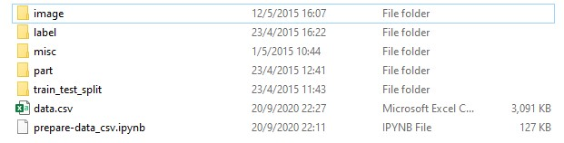

### CZ4042 Project AY20/21 SEM 1
This project is a modification of the original [MMALNet](https://arxiv.org/abs/2003.09150) by Fan Zhang, Meng Li, Guisheng Zhai, and Yizhao Liu.

The experiment is performed on the CompCars dataset.

For assessing the project, please refer to the sections on `Installing Dependencies`, `Downloading the CompCars Dataset` and `Testing MMALNet`.
Please also refer to `Important Files` for a brief description of the main files in the repository.

### Installing Dependencies
Instructions for setting up the required conda environment (pip can be used as well):
- Create a conda environment: `conda create --name ENV_NAME`
- Ensure conda environment is activated: `conda activate ENV_NAME`
- Install Python 3.7.x: `conda install python=3.7`
- Install PyTorch and TorchVision via pytorch channel: `conda install pytorch torchvision -c pytorch`
- Install other packages: `conda install numpy pandas tqdm pillow imageio scikit-learn scikit-image`
- Install tensorboardX and PyPNG: `conda install tensorboardx pypng -c conda-forge`
- Install tensorboard: `conda install tensorboard`
- Install OpenCV: `conda install opencv`
- Install RandAug: `pip install git+https://github.com/ildoonet/pytorch-randaugment`
	- This package must be installed via `pip`
	- To install this package without git+, download the repo and simply install the downloaded .zip file: `pip install <zipfile name>.zip`
	- More details on RandAug can be found in this [paper](https://arxiv.org/abs/1909.13719)

### Downloading the CompCars Dataset
1. Download the `CompCars` dataset. The download links and original instructions are available [here](http://mmlab.ie.cuhk.edu.hk/datasets/comp_cars/instruction.txt)
	- Follow the instructions to downloading the 23 files (data.zip, data.z01 - data.z22)
	- Ensure all 23 files are in `datasets/CompCars` alongside `data.csv` and `prepare-data_csv.ipynb`
	- Extract `data.zip`
		- Either directly extract the 5 folders: `image`, `label`, `misc`, `part` and `train_test_split` from within `data.zip`
		- OR extract `data.zip`, and move the 5 folders out from the `data` folder that is extracted
	- The 5 folders: `image`, `label`, `misc`, `part` and `train_test_split` should reside in the same directory as `data.csv` and `prepare-data_csv.ipynb`

### Running MMALNet for Fine Tuning
This section is not required for testing the model but indicates the workflow used during training
1. Download the [pretrained model of ResNet-50](https://download.pytorch.org/models/resnet50-19c8e357.pth) and move it to `models/pretrained`
	- Ensure `pretrain_path` variable in `config.py` is set to point to the pretrained ResNet model path
	- Other ResNets like ResNet-152 can also be used if desired
	
2. For cases where GPU memory is insufficient: tweak `N_list`, or lower `batch_size`, these parameters can be found in `config.py`
	- The parameter N_list is N1, N2, N3 in the [original paper](https://arxiv.org/pdf/2003.09150v3.pdf) and you can adjust them according to GPU memory
	- batch_size can be lowered to 3 or below
		
3. Ensure `config.py` variables are set properly
	- `eval_trainset`
		- This is to allow evaluation metrics to be obtained for the training
		- If no training metrics are desired, set to `False` to save training time
	- `set`
		- Set to `CompCars` to load CompCars dataset; Can be set to other datasets like CUB200, etc.
	- `rand_aug`
		- Set to `True` if RandAug (Random Augmentation) is to be used for training, else set to `False`
		- Does not affect testing as RandAug is not used in testing phase.
	- `num_folds`
		- Set the number of folds for Stratified K-Folds cross validation
	- `start_from_fold`
		- Change this to the fold you wish to begin from; to be used when resuming training.
		- NOTE: that this value may cause unexpected behaviour if improperly set; e.g. if you wish to resume training from fold 2 (i.e. stopped training at fold 2), then set `start_from_fold=2`
	- `patience`
		- Training stops if more than the specified number of epochs elapsed without an improvement in specified metric
		- Specified metric for our purposes on CompCars dataset is the local_accuracy metric
	- `patience_counter`
		- This should be initialised to 0
	- `num_classes`
		- For `CompCars` dataset:
			- Predict `car_model` - set to 431
			- Predict `car_make` - set to 75
			- Multi-Task Learning on both `car_model` and `car_make` - set to a tuple of (431, 75), with (`car_model`, `car_make`)
	
4. Run `python tuning.py` to commence training
	- Train dataset will be split into training and validation sets (80:20), and Stratified K-Folds is performed for k=5
		- To be used for hyperparameter tuning or evaluating model modifications
	- During training, the `tensorboardx` log file and epoch checkpoints will be saved in their respective folds' directories
	- `tensorboardx` log files can be viewed via `tensorboard`
	
5. Run `python train.py` to train finalised model
	- Training and testing will be performed on the original (50:50) data split

### Testing MMALNet
1. Ensure `num_classes` and `multitask` variables is set accordingly for testing our saved model trained with `RandAugment` without Multi-Task Learning:
		- Set `num_classes` to 431 and `multitask` to False in `config.py`
2. Ensure variables are set properly in `test.py`
	- Ensure `set` variable is set to `CompCars`, for properly assessing our saved model trained on the `CompCars` dataset
	- Download the trained model provided and place the `.pth` file in the location indicated by `pth_path` (i.e. `./models`)
		- The available saved models are from training to predict:
			- `car_model` with `RandAug` (N:1, M:15): https://drive.google.com/file/d/110d8qEYI6LGtDV_S9H1IrdAK6SiAs4Zy/view?usp=sharing
			- The model filename indicates the epoch that the model with the best `local_accuracy` was saved at
			- Ensure that the `pth_path` variable in `test.py` points to the location of the downloaded saved model
				- e.g. if trained model filename is `car_model_randaug_epoch45.pth`, then ensure `pth_path` properly reflects the saved model's filename: `./models/car_model_randaug_epoch45.pth`
		
3. Run `python test.py` to test the model
	- NOTE: the testloader should be modified to contain only unseen data for accurate evaluation of model accuracy
	- For cases where GPU memory is insufficient: lower `batch_size`
	
### Important Files
1. `train.py`
	- Trains a model on the original CompCars train test split (50:50)
	- 16016 training images and 14939 test images
	- Used to train the final model

2. `tuning.py`
	- Runs 5-fold Stratified Cross Validation, by splitting the original CompCars training dataset into train and validation split (80:20)
	- 12812 training images and 3204 validation images
	- Used for hyperparameter tuning or model selection
	
3. `config.py`
	- Holds the config variables used in MMALNet
	- Additional variables included in our code are described in the section on `Running MMALNet for Fine Tuning`

4. `test.py`
	- Runs a test on a trained model via the 14939 test images from the original CompCars train test split
	
5. Files in `randaug_hyp_tuning_parsers`
	- Files used in parsing the tensorboard logs for hyperparameter tuning on RandAugment parameters N and M
	
6. `datasets/CompCars/prepare-data_csv.ipynb`
	- Notebook used to prepare the image paths and information of the car (number of doors, car model, car make, etc.)
	- Outputs `data.csv`